[Objectifying Captions]{.c15 .c28 .c33}

[Image Caption Generation Using Object Information]{.c15 .c50}

[W266]{.c3}

[Noah Randolph, Harry Xu]{.c3}

[22 April 2018]{.c3}

[]{.c3}

[Abstract]{.c15 .c40 .c28} {#h.hmgty3oj5y91 .c10}
==========================

[A potential enhancement to image caption generation, building on a
recent innovation called OBJECT2TEXT (Yin & Ordonez, 2017) is explored.
OBJECT2TEXT is an encoder that can be used to train models on images
from the MS-COCO dataset (Lin, et al., 2014), which have objects within
images labeled with rectangular extents and object categories (e.g. dog,
car, table). This paper attempts to capture potentially useful
information in the form of relative object areas and perimeters within
images to improve image caption generation. Several models are created
and results are analyzed on size and depth descriptions in the resulting
generated captions. Evidence in the form of image captions from baseline
and modified models shows a difference in the presence of size and depth
related words. However broad word counts across all the models reveal
the effect to be small and inconsistent.]{.c1}

[Introduction]{} {#h.7grxla8p6krz .c13}
================

[Image captioning presents a unique challenge in two fields: computer
vision and natural language processing. It showcases the ability for the
computer to understand the objects in an image while producing human
readable descriptions. There have been many approaches to image
captioning, with the latest successes building from the deep learning
framework, where neural networks are utilized to understand images as
well as produce captions. We investigate a recent paper, “OBJ2TEXT:
Generating Visually Descriptive Language from Object Layouts”
]{.c12}[(Yin & Ordonez, 2017), which utilizes a sequence to sequence
model to encode the objects and their locations in an image as an input
sequence to an LSTM and decode the representation with an LSTM language
model. We implement their framework while exploring additional
modifications to improve upon the results. Specifically, we seek to
increase the model’s understanding of the images by inputting additional
object attributes such as the notion of object size. We propose that by
adding these features, our language model will be able to produce more
meaningful captions with object relations better known.]{.c1}

[Background ]{} {#h.18ragtqvrlm0 .c13}
===============

[The paper by Yin & Ordonez, ]{.c12}[OBJ2TEXT]{.c2}[, utilizes a related
work, ]{.c12}[You Only Look Once ]{.c2}[(YOLO)]{.c12}[: Unified,
Real-Time Object Detection]{.c2}[ ]{.c12}[(Redmon & Farhadi, 2017). YOLO
is a new approach to object detection which encapsulates the entire
image detection task into one convolutional neural network. It treats
object detection as a single regression problem and uses a CNN to train
and predict the objects in an image’s bounding box as well as classify
the object type. YOLO’s improvement on the previous image recognition
frameworks is increased speed that can be offered by only having one CNN
and which also allows for real time object detection. ]{.c15 .c1}

[]{.c15 .c1}

[OBJ2TEXT is combined with YOLO to encode objects for use in a natural
language system. Using object locations in the images as well as the
number of each category as features, OBJ2TEXT-YOLO is combined with an
image caption generation model, based on Neuraltalk2 (K., 2016), that
combines a convolutional neural net for image classification whose
information is encoded into a vector for input into a recurrent neural
network language model. OBJECT2TEXT-YOLO is an encoder that can be used
to train models on images from the MS-COCO dataset (Lin, et al., 2014).
MS-COCO dataset image annotations include objects labeled from a
selection of categories (e.g. dog, car, table). The objects are
identified in the images through two means, one of which is segmentation
and the other using rectangular extents. OBJECT2TEXT-YOLO does not use
the objects labeled in the MS-COCO dataset for training, and instead
encodes them on its own (using YOLO) prior to training on MS-COCO image
captions. ]{.c15 .c1}

[The idea behind encoding object information when you already have all
of the image pixel information follows previous work using clipart
scenes (Zitnick, et al., 2013), where the attempt is to separate pattern
recognition (in pixels) from visual meaning.]{.c1}

[Methods]{} {#h.ruwgokd574b2 .c13}
===========

[Using 200,000 training iterations, the performance and caption results
of the Location Encoder and category word embedding of each object in an
image, with a max sampling decoder (temperature = 1.0),]{}[ is used as a
baseline. The baseline comes from Yin & Ordonez, 2017 and is briefly
described below.]{.c15 .c1}

[]{.c15 .c1}

[Both the encoder and decoder are trained according to Equation 1.]{.c15
.c1}

[]{.c15 .c1}

[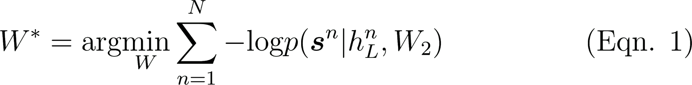]{style="overflow: hidden; display: inline-block; margin: 0.00px 0.00px; border: 0.00px solid #000000; transform: rotate(0.00rad) translateZ(0px); -webkit-transform: rotate(0.00rad) translateZ(0px); width: 413.33px; height: 50.67px;"}

[]{.c15 .c1}

[Where
]{.c1}[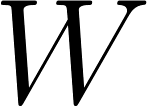]{style="overflow: hidden; display: inline-block; margin: 0.00px 0.00px; border: 0.00px solid #000000; transform: rotate(0.00rad) translateZ(0px); -webkit-transform: rotate(0.00rad) translateZ(0px); width: 17.33px; height: 12.00px;"}[ includes
both the encoder and decoder parameters,
]{.c1}[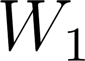]{style="overflow: hidden; display: inline-block; margin: 0.00px 0.00px; border: 0.00px solid #000000; transform: rotate(0.00rad) translateZ(0px); -webkit-transform: rotate(0.00rad) translateZ(0px); width: 20.00px; height: 14.67px;"}[ and
]{.c1}[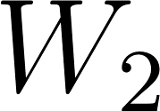]{style="overflow: hidden; display: inline-block; margin: 0.00px 0.00px; border: 0.00px solid #000000; transform: rotate(0.00rad) translateZ(0px); -webkit-transform: rotate(0.00rad) translateZ(0px); width: 21.33px; height: 14.67px;"}[.
]{.c1}[]{style="overflow: hidden; display: inline-block; margin: 0.00px 0.00px; border: 0.00px solid #000000; transform: rotate(0.00rad) translateZ(0px); -webkit-transform: rotate(0.00rad) translateZ(0px); width: 13.33px; height: 12.00px;"}[ is
the number of training observations.
]{.c1}[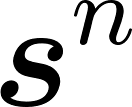]{style="overflow: hidden; display: inline-block; margin: 0.00px 0.00px; border: 0.00px solid #000000; transform: rotate(0.00rad) translateZ(0px); -webkit-transform: rotate(0.00rad) translateZ(0px); width: 16.00px; height: 12.00px;"}[ is
a target caption.
]{.c1}[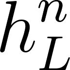]{style="overflow: hidden; display: inline-block; margin: 0.00px 0.00px; border: 0.00px solid #000000; transform: rotate(0.00rad) translateZ(0px); -webkit-transform: rotate(0.00rad) translateZ(0px); width: 16.00px; height: 16.00px;"}[ is
the encoded object layout and category of image
]{.c1}[]{style="overflow: hidden; display: inline-block; margin: 0.00px 0.00px; border: 0.00px solid #000000; transform: rotate(0.00rad) translateZ(0px); -webkit-transform: rotate(0.00rad) translateZ(0px); width: 8.00px; height: 8.00px;"}[ at
time
]{.c1}[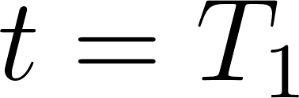]{style="overflow: hidden; display: inline-block; margin: 0.00px 0.00px; border: 0.00px solid #000000; transform: rotate(0.00rad) translateZ(0px); -webkit-transform: rotate(0.00rad) translateZ(0px); width: 45.33px; height: 14.67px;"}[ (the
end of the encoding step) to generate caption
]{.c1}[]{style="overflow: hidden; display: inline-block; margin: 0.00px 0.00px; border: 0.00px solid #000000; transform: rotate(0.00rad) translateZ(0px); -webkit-transform: rotate(0.00rad) translateZ(0px); width: 8.00px; height: 8.00px;"}[,
computed as in Equation 2.]{.c15 .c1}

[]{.c15 .c1}

[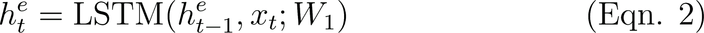]{style="overflow: hidden; display: inline-block; margin: 0.00px 0.00px; border: 0.00px solid #000000; transform: rotate(0.00rad) translateZ(0px); -webkit-transform: rotate(0.00rad) translateZ(0px); width: 380.00px; height: 17.33px;"}[ ]{.c15
.c1}

[]{.c15 .c1}

[Where
]{.c1}[]{style="overflow: hidden; display: inline-block; margin: 0.00px 0.00px; border: 0.00px solid #000000; transform: rotate(0.00rad) translateZ(0px); -webkit-transform: rotate(0.00rad) translateZ(0px); width: 6.67px; height: 8.00px;"}[ stands
for encoder. The input
]{.c1}[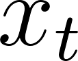]{style="overflow: hidden; display: inline-block; margin: 0.00px 0.00px; border: 0.00px solid #000000; transform: rotate(0.00rad) translateZ(0px); -webkit-transform: rotate(0.00rad) translateZ(0px); width: 13.33px; height: 10.67px;"}[ is
defined as in Equation 3.]{.c15 .c1}

[]{.c15 .c1}

[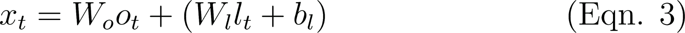]{style="overflow: hidden; display: inline-block; margin: 0.00px 0.00px; border: 0.00px solid #000000; transform: rotate(0.00rad) translateZ(0px); -webkit-transform: rotate(0.00rad) translateZ(0px); width: 368.00px; height: 17.33px;"}

[ ]{.c15 .c1}

[Where
]{.c1}[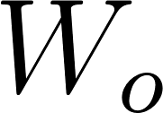]{style="overflow: hidden; display: inline-block; margin: 0.00px 0.00px; border: 0.00px solid #000000; transform: rotate(0.00rad) translateZ(0px); -webkit-transform: rotate(0.00rad) translateZ(0px); width: 21.33px; height: 14.67px;"}[ is
a category word embedding matrix, the categories are represented in a
one-hot vector in
]{.c1}[]{style="overflow: hidden; display: inline-block; margin: 0.00px 0.00px; border: 0.00px solid #000000; transform: rotate(0.00rad) translateZ(0px); -webkit-transform: rotate(0.00rad) translateZ(0px); width: 12.00px; height: 10.67px;"}[.
]{.c1}[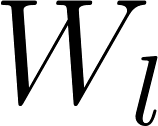]{style="overflow: hidden; display: inline-block; margin: 0.00px 0.00px; border: 0.00px solid #000000; transform: rotate(0.00rad) translateZ(0px); -webkit-transform: rotate(0.00rad) translateZ(0px); width: 18.67px; height: 14.67px;"}[ and
]{.c1}[]{style="overflow: hidden; display: inline-block; margin: 0.00px 0.00px; border: 0.00px solid #000000; transform: rotate(0.00rad) translateZ(0px); -webkit-transform: rotate(0.00rad) translateZ(0px); width: 9.33px; height: 14.67px;"}[ comprise
the parameters of the object location encoder, and
]{.c1}[]{style="overflow: hidden; display: inline-block; margin: 0.00px 0.00px; border: 0.00px solid #000000; transform: rotate(0.00rad) translateZ(0px); -webkit-transform: rotate(0.00rad) translateZ(0px); width: 8.00px; height: 14.67px;"}[ is
the object location vector containing the x and y coordinates as well as
the width and height of the object input at time
]{.c1}[]{style="overflow: hidden; display: inline-block; margin: 0.00px 0.00px; border: 0.00px solid #000000; transform: rotate(0.00rad) translateZ(0px); -webkit-transform: rotate(0.00rad) translateZ(0px); width: 4.00px; height: 10.67px;"}[.]{.c15
.c1}

[]{.c15 .c1}

[The generated caption
]{.c1}[]{style="overflow: hidden; display: inline-block; margin: 0.00px 0.00px; border: 0.00px solid #000000; transform: rotate(0.00rad) translateZ(0px); -webkit-transform: rotate(0.00rad) translateZ(0px); width: 8.00px; height: 8.00px;"}[ is
determined according to Equation 4. ]{.c15 .c1}

[]{.c15 .c1}

[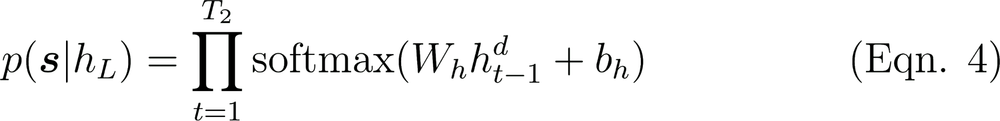]{style="overflow: hidden; display: inline-block; margin: 0.00px 0.00px; border: 0.00px solid #000000; transform: rotate(0.00rad) translateZ(0px); -webkit-transform: rotate(0.00rad) translateZ(0px); width: 420.00px; height: 50.67px;"}

[]{.c15 .c1}

[Where
]{.c1}[]{style="overflow: hidden; display: inline-block; margin: 0.00px 0.00px; border: 0.00px solid #000000; transform: rotate(0.00rad) translateZ(0px); -webkit-transform: rotate(0.00rad) translateZ(0px); width: 8.00px; height: 12.00px;"}[ stands
for decoder and
]{.c1}[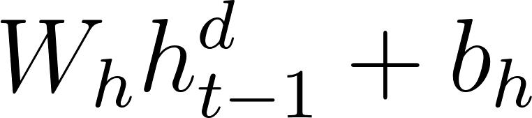]{style="overflow: hidden; display: inline-block; margin: 0.00px 0.00px; border: 0.00px solid #000000; transform: rotate(0.00rad) translateZ(0px); -webkit-transform: rotate(0.00rad) translateZ(0px); width: 90.67px; height: 20.00px;"}[ computes
a vector of the hidden states of the decoder LSTM.
]{.c1}[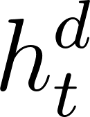]{style="overflow: hidden; display: inline-block; margin: 0.00px 0.00px; border: 0.00px solid #000000; transform: rotate(0.00rad) translateZ(0px); -webkit-transform: rotate(0.00rad) translateZ(0px); width: 14.67px; height: 20.00px;"}[ is
computed as in Equation 5. ]{.c15 .c1}

[]{.c15 .c1}

[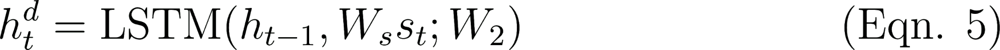]{style="overflow: hidden; display: inline-block; margin: 0.00px 0.00px; border: 0.00px solid #000000; transform: rotate(0.00rad) translateZ(0px); -webkit-transform: rotate(0.00rad) translateZ(0px); width: 400.00px; height: 20.00px;"}[ 
]{.c15 .c1}

[]{.c15 .c1}

[Where
]{.c1}[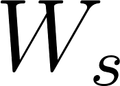]{style="overflow: hidden; display: inline-block; margin: 0.00px 0.00px; border: 0.00px solid #000000; transform: rotate(0.00rad) translateZ(0px); -webkit-transform: rotate(0.00rad) translateZ(0px); width: 20.00px; height: 14.67px;"}[ is
a category embedding matrix for caption sequence of symbols.]{.c15 .c1}

[]{.c15 .c1}

[With the baseline described as in the equations above, our
modifications include altering the location configuration vector
]{.c1}[]{style="overflow: hidden; display: inline-block; margin: 0.00px 0.00px; border: 0.00px solid #000000; transform: rotate(0.00rad) translateZ(0px); -webkit-transform: rotate(0.00rad) translateZ(0px); width: 8.00px; height: 14.67px;"}[ by
replacing the object width and height dimensions with object area and
perimeter. The model is shown in Figure 1, below.]{.c15 .c1}

[]{.c15 .c1}

[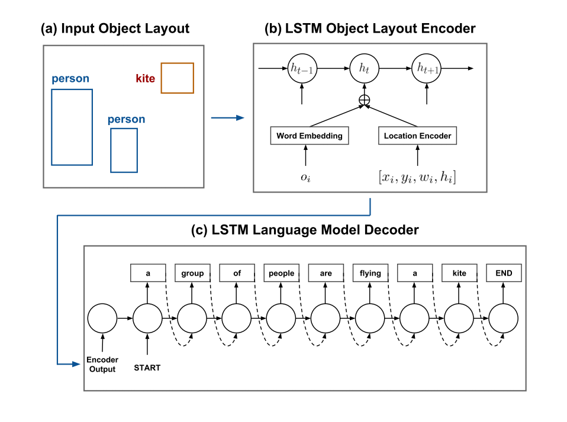]{style="overflow: hidden; display: inline-block; margin: 0.00px 0.00px; border: 0.00px solid #000000; transform: rotate(0.00rad) translateZ(0px); -webkit-transform: rotate(0.00rad) translateZ(0px); width: 445.78px; height: 333.50px;"}

[Figure 1. Model layout from ]{}[Yin & Ordonez, 2017 is shown above. The
Location Encoder in box (b) is modified from containing width
]{.c1}[]{style="overflow: hidden; display: inline-block; margin: 0.00px 0.00px; border: 0.00px solid #000000; transform: rotate(0.00rad) translateZ(0px); -webkit-transform: rotate(0.00rad) translateZ(0px); width: 16.00px; height: 10.67px;"}[ and
height
]{.c1}[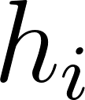]{style="overflow: hidden; display: inline-block; margin: 0.00px 0.00px; border: 0.00px solid #000000; transform: rotate(0.00rad) translateZ(0px); -webkit-transform: rotate(0.00rad) translateZ(0px); width: 12.00px; height: 14.67px;"}[ to
containing area
]{.c1}[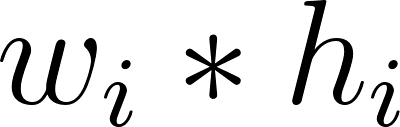]{style="overflow: hidden; display: inline-block; margin: 0.00px 0.00px; border: 0.00px solid #000000; transform: rotate(0.00rad) translateZ(0px); -webkit-transform: rotate(0.00rad) translateZ(0px); width: 48.00px; height: 14.67px;"}[ and
perimeter
]{.c1}[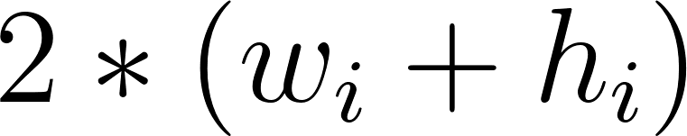]{style="overflow: hidden; display: inline-block; margin: 0.00px 0.00px; border: 0.00px solid #000000; transform: rotate(0.00rad) translateZ(0px); -webkit-transform: rotate(0.00rad) translateZ(0px); width: 90.67px; height: 17.33px;"}[.]{.c1}

[]{.c3}

[]{.c3}

[The modified Location Encoder that includes area (width x height) of
the object bounding boxes is then also trained with 200,000 iterations
to be compared against the baseline both qualitatively and with the
Bleu-4 score.]{.c15 .c1}

[]{.c15 .c1}

[Further analysis for comparison is made by including the Neuraltalk2
image caption generator word embeddings (K., 2016), which is the more
familiar pixel-based pattern recognizing CNN-RNN caption generator,
along with the object embeddings in OBJ2TEXT-YOLO. The full model is
trained as another baseline to compare against another full model that
includes the aforementioned Location Encoder modified to include area
and perimeter. ]{.c1 .c15}

[]{.c15 .c1}

[Lastly, the baseline and modified models (objects only, no CNN derived
word embeddings) are altered to include a beam search in the decoding
RNN. Width 5 is used according to custom as well as to keep GPU time to
a minimum.]{.c15 .c1}

[]{.c15 .c1}

[For all models above, in addition to score metrics, qualitative
assessments of size and orientation word counts (e.g. large, small,
back, front) in the generated captions are computed to observe
characteristic changes in captions generated between the models, in
order to assess whether depth and size information is generated as
predicted. Figure 2, below, is a summary of all the model configurations
that were tested and will be discussed in the next session.]{.c15 .c1}

[]{.c15 .c1}

[]{style="overflow: hidden; display: inline-block; margin: 0.00px 0.00px; border: 0.00px solid #000000; transform: rotate(0.00rad) translateZ(0px); -webkit-transform: rotate(0.00rad) translateZ(0px); width: 552.20px; height: 264.50px;"}[ ]{.c15
.c1}

[Figure 2. Summary of the model variations tested. The first column
contains the baselines, where the YOLO-generated object positions are
not modified.]{.c15 .c1}

[]{.c15 .c1}

[Results and Discussion]{} {#h.uqwu2w8dq4nc .c13}
==========================

[Initial]{}[ results were very promising, as the image in Figure 3,
below, was quickly found to show evidence of the position code
modifications having an effect. You can see how the modified object
embedding (using area) may have caused the difference in size of the
elephants in the photo’s generated caption.]{}

------------------------------------------------------------------------

[]{.c3}

[]{.c3}

[]{#t.ce3b20590cb907a28928a31d1d211980f1177738}[]{#t.0}

+-----------------------------------------------------------------------+
| [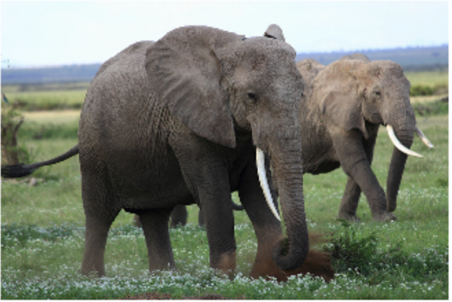]{style="overflow: hidden; display: inline-bl |
| ock; margin: 0.00px 0.00px; border: 0.00px solid #000000; transform:  |
| rotate(0.00rad) translateZ(0px); -webkit-transform: rotate(0.00rad) t |
| ranslateZ(0px); width: 269.94px; height: 180.46px;"}                  |
+-----------------------------------------------------------------------+
| [Training captions]{.c32}[:]{.c3}                                     |
|                                                                       |
| -   [Two elephant walking, the one in the foreground kicking up a     |
|     some dirt. ]{.c15 .c4 .c28}                                       |
| -   [Two elephants walk around in a large grassy field. ]{.c15 .c4    |
|     .c28}                                                             |
| -   [two elephants with long walking through the grass]{.c15 .c4      |
|     .c28}                                                             |
| -   [An elephant kicking some dirt on the ground.]{.c15 .c4 .c28}     |
| -   [two very big elephants walking in the wild]{.c15 .c4 .c28}       |
+-----------------------------------------------------------------------+
| [Objects-only generated baseline caption]{.c32 .c4}[:]{.c15 .c4 .c28} |
|                                                                       |
| -   [two elephants standing in a field with trees in the              |
|     background]{.c15 .c4 .c28}                                        |
+-----------------------------------------------------------------------+
| [Objects-only generated caption with position code including area &   |
| width]{.c4 .c32}[:]{.c15 .c4 .c28}                                    |
|                                                                       |
| -   [a ]{.c4}[baby]{.c4 .c42}[ elephant standing next to a            |
|     ]{.c4}[larger]{.c4 .c42}[ elephant (bolded words for              |
|     emphasis)]{.c15 .c4 .c28}                                         |
+-----------------------------------------------------------------------+

[Figure 3. Initial promising results showing potential effect of object
position code modifications, reflected in size words present in
generated caption.]{.c3}

[]{.c15 .c4 .c28}

[]{.c15 .c4 .c28}

[Observing the size-and-depth-related word counts between the baseline
and different variations of area and width in the object position code
leads to much less conclusive results, as seen below in Figure 4. Area
and perimeter models dominate in counts of the words ‘background,’
‘large,’ ‘back,’ ‘short,’ and ‘tall,’ especially the words ‘back’ and
‘background.’ However, the baseline dominates the counts of ‘front’ and
‘short.’]{.c3}

[]{.c3}

[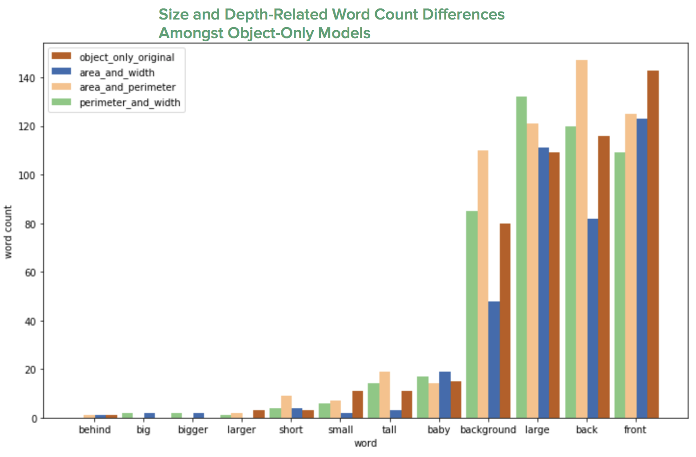]{style="overflow: hidden; display: inline-block; margin: 0.00px 0.00px; border: 0.00px solid #000000; transform: rotate(0.00rad) translateZ(0px); -webkit-transform: rotate(0.00rad) translateZ(0px); width: 589.96px; height: 389.50px;"}

[Figure 4. Word counts of size-and-depth-related words between the
baseline (red) and the modified object-only models (yellow, blue, and
green) reveal mixed results.]{.c3}

[]{.c3}

[Given the mixed results of the models above, two more variations of the
model were implemented, one of which included adding ]{}[the CNN-RNN
Neuraltalk2 image caption generator word embeddings (K., 2016). The
other variation involved changing the decoder from max sampling
(temperature = 1.0) to a beam search decoder with beam width k = 5.
Results of the two variations are shown in Figure 5 and Figure 6, below.
The size-and-depth-related word counts are even less conclusive than the
original object-only results. In fact, the CNN-RNN Neuraltalk2 inclusion
seemed to reverse the effect of the width and area in the object
position code (K., 2016). Both models in Figures 5 and 6 narrow the gap
between word count differences amongst the baseline and modified models
when compared to the models in Figure 4.]{.c1}

[]{.c3}

[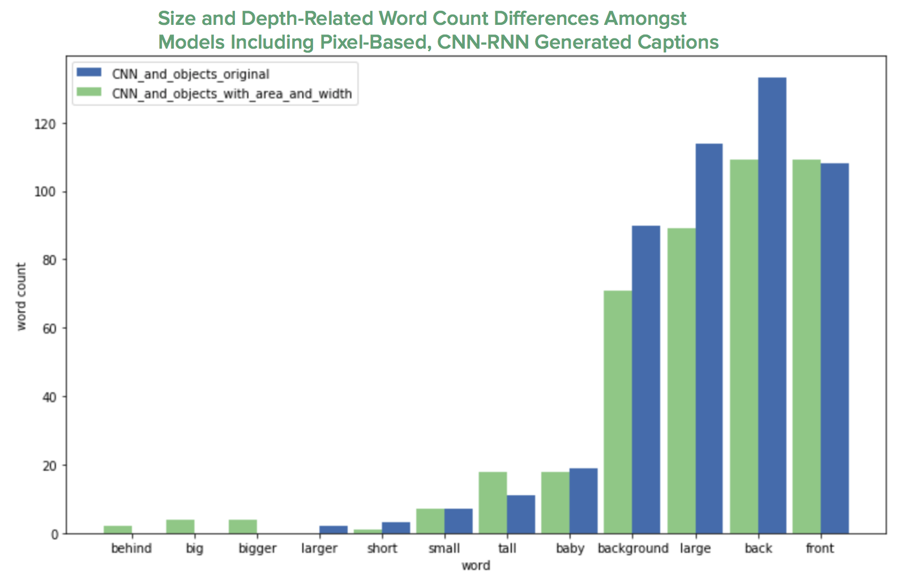]{style="overflow: hidden; display: inline-block; margin: 0.00px 0.00px; border: 0.00px solid #000000; transform: rotate(0.00rad) translateZ(0px); -webkit-transform: rotate(0.00rad) translateZ(0px); width: 535.50px; height: 345.24px;"}

[Figure 5. This plot shows the baseline and modified object position
code models with included CNN-RNN NeuralTalk2 word embeddings ]{}[(K.,
2016)]{.c45}[. ]{.c3}

[]{.c3}

[]{.c3}

[]{style="overflow: hidden; display: inline-block; margin: 0.00px 0.00px; border: 0.00px solid #000000; transform: rotate(0.00rad) translateZ(0px); -webkit-transform: rotate(0.00rad) translateZ(0px); width: 528.50px; height: 340.18px;"}[ ]{.c3}

[Figure 6. This plot shows the objects-only baseline and modified object
position code models with a decoder beam search of width k = 5.]{.c3}

[]{.c3}

[]{.c3}

[Below, we look in detail at several captions generated by the models
described thus far. First, the five ground-truth captions from the COCO
dataset are shown, followed by captions generated by each aforementioned
model.]{.c3}

[]{.c3}

[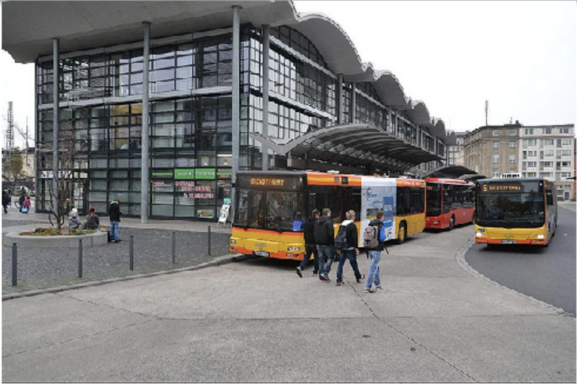]{style="overflow: hidden; display: inline-block; margin: 0.00px 0.00px; border: 0.00px solid #000000; transform: rotate(0.00rad) translateZ(0px); -webkit-transform: rotate(0.00rad) translateZ(0px); width: 476.50px; height: 317.67px;"}

[Figure 7. Image ID 562805]{.c3}

[]{.c3}

[Ground-truth captions:]{.c3}

1.  [A modern transportation building with busses lined up for
    passengers.]{.c7}
2.  [A bus station with buses and people nearby. ]{.c7}
3.  [Buses parked at a bus stop while unloading passengers.]{.c7}
4.  [A bus depot with buses parked in front. ]{.c7}
5.  [some people buildings and three different buses and a tree]{.c7}

[]{.c7}

[Generated captions:]{.c7}

[]{.c7}

[]{#t.f03f34c655cd3602b674705c32b8aa8af47dde4a}[]{#t.1}

+-----------------------+-----------------------+-----------------------+
| []{.c24 .c5}          | [original, unmodified | [with modified object |
|                       | object position       | position code]{.c24   |
|                       | code]{.c24 .c5}       | .c5}                  |
+-----------------------+-----------------------+-----------------------+
| [max search           | [a group of people    | [a bus is driving     |
| decoder]{.c24 .c5}    | standing on a street  | down the street with  |
|                       | next to a bus]{.c7}   | a bus ]{.c9}[behind   |
|                       |                       | ]{.c5}[it]{.c7}       |
+-----------------------+-----------------------+-----------------------+
| [beam search          | [a group of people    | [a couple of buses    |
| decoder]{.c5 .c24}    | standing in a parking | that are sitting in   |
|                       | lot]{.c7}             | the street]{.c7}      |
+-----------------------+-----------------------+-----------------------+
| [including            | [a group of people    | [a bus is driving     |
| CNN-RNN]{.c24 .c5}    | standing on a city    | down the street with  |
|                       | street]{.c7}          | people walking]{.c7}  |
+-----------------------+-----------------------+-----------------------+

[]{.c7}

[For the captions generated by the Figure 7, only one model (in the top
right cell) included a size or depth related word to describe the
relation between two similar objects. The top left cell includes the
positional phrase ‘next to,’ but it’s referring to two different objects
(people and bus). Since two different objects can have different sizes,
it’s unlikely for ‘next to’ in this case to be related to the object
position code (which happens to be unmodified). It would only make sense
for the sizes or positions of two similar objects (that have presumably
the same real world size, like two buses) to be affected by the object
position code.]{.c7}

[]{.c7}

[]{.c7}

[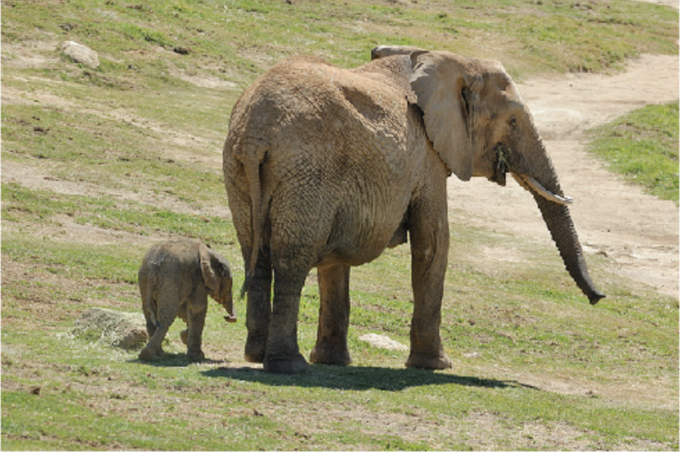]{style="overflow: hidden; display: inline-block; margin: 0.00px 0.00px; border: 0.00px solid #000000; transform: rotate(0.00rad) translateZ(0px); -webkit-transform: rotate(0.00rad) translateZ(0px); width: 470.50px; height: 312.91px;"}

[Figure 8. Image ID 198178]{.c7}

[]{.c7}

[Ground-truth captions:]{.c3}

1.  [A large elephant standing next to a small elephant.]{.c7}
2.  [An adult and baby elephant walking beside each other.]{.c7}
3.  [Adult elephant with young walking in grassy area.]{.c7}
4.  [And elephant walks with its baby elephant. ]{.c7}
5.  [A big and a small elephant out in the sun]{.c7}

[]{.c7}

[Generated captions:]{.c7}

------------------------------------------------------------------------

[]{.c7}

[]{.c7}

[]{#t.895f4465a1e0dd1fd0ada22eff4b3e77ebfcb24b}[]{#t.2}

+-----------------------+-----------------------+-----------------------+
| []{.c24 .c5}          | [original, unmodified | [with modified object |
|                       | object position       | position code]{.c24   |
|                       | code]{.c24 .c5}       | .c5}                  |
+-----------------------+-----------------------+-----------------------+
| [max search           | [a large elephant     | [a                    |
| decoder]{.c24 .c5}    | standing next to a    | ]{.c9}[large]{.c5}[ e |
|                       | tree]{.c7}            | lephant               |
|                       |                       | standing next to a    |
|                       |                       | ]{.c9}[baby]{.c5}[ el |
|                       |                       | ephant]{.c7}          |
+-----------------------+-----------------------+-----------------------+
| [beam search          | [an elephant standing | [a                    |
| decoder]{.c24 .c5}    | in the middle of a    | ]{.c9}[large]{.c5}[ e |
|                       | field]{.c7}           | lephant               |
|                       |                       | standing next to a    |
|                       |                       | ]{.c9}[baby]{.c5}[ el |
|                       |                       | ephant]{.c7}          |
+-----------------------+-----------------------+-----------------------+
| [including            | [a couple of          | [a                    |
| CNN-RNN]{.c24 .c5}    | elephants standing    | ]{.c9}[baby]{.c5}[ el |
|                       | next to each          | ephant                |
|                       | other]{.c7}           | standing next to a    |
|                       |                       | ]{.c9}[bigger]{.c5}[  |
|                       |                       | elephant]{.c7}        |
+-----------------------+-----------------------+-----------------------+

[]{.c7}

[]{.c7}

[The iconic image of two elephants in Figure 8 results in captions with
modified object position codes clearly expressing size relationships
between the elephants. Contrast that to the captions generated by the
original object position code, where there are no relational words to
describe size or depth differences between elephants. The top left
cell’s caption does include the word ‘large’ but it is not in relation
to another elephant.]{.c7}

[]{.c7}

[]{.c7}

[]{style="overflow: hidden; display: inline-block; margin: 0.00px 0.00px; border: 0.00px solid #000000; transform: rotate(0.00rad) translateZ(0px); -webkit-transform: rotate(0.00rad) translateZ(0px); width: 478.20px; height: 316.50px;"}

[Figure 9. Image ID 322307]{.c7}

[]{.c7}

[Ground-truth captions:]{.c3}

1.  [A mama elephant standing next to a baby elephant in a cage at a
    zoo.]{.c7}
2.  [An elephant in a cage with its baby.]{.c7}
3.  [a baby elephant and a large elephant standing near one
    another]{.c7}
4.  [A ELEPHANT IS WALKING NEXT TO ITS BABY CUTIE!]{.c7}
5.  [The baby elephant stays close to its mother.]{.c7}

[]{.c7}

[Generated captions:]{.c7}

[]{.c7}

[]{#t.8caf5a0272e0d485e31c2404fa46f14439c1ac5e}[]{#t.3}

+-----------------------+-----------------------+-----------------------+
| []{.c24 .c5}          | [original, unmodified | [with modified object |
|                       | object position       | position code]{.c24   |
|                       | code]{.c24 .c5}       | .c5}                  |
+-----------------------+-----------------------+-----------------------+
| [max search           | [two elephants are    | [a                    |
| decoder]{.c24 .c5}    | standing in a field   | ]{.c9}[baby]{.c5}[ el |
|                       | of grass]{.c7}        | ephant                |
|                       |                       | standing next to a    |
|                       |                       | ]{.c9}[larger]{.c5}[  |
|                       |                       | elephant]{.c7}        |
+-----------------------+-----------------------+-----------------------+
| [beam search          | [a couple of          | [a                    |
| decoder]{.c24 .c5}    | elephants standing    | ]{.c9}[large]{.c5}[ e |
|                       | next to each          | lephant               |
|                       | other]{.c7}           | standing next to a    |
|                       |                       | ]{.c9}[baby]{.c5}[ el |
|                       |                       | ephant]{.c7}          |
+-----------------------+-----------------------+-----------------------+
| [including            | [a                    | [a                    |
| CNN-RNN]{.c24 .c5}    | ]{.c9}[baby]{.c5}[ el | ]{.c9}[baby]{.c5}[ el |
|                       | ephant                | ephant                |
|                       | is standing in front  | standing next to a    |
|                       | of a                  | ]{.c9}[bigger]{.c5}[  |
|                       | ]{.c9}[larger]{.c5}[  | elephant]{.c7}        |
|                       | elephant]{.c7}        |                       |
+-----------------------+-----------------------+-----------------------+

[]{.c7}

[]{.c3}

[Note that there are many elephant photos in the COCO dataset. The
captions generated by Figure 9, as in Figure 8, include size relations
between the elephant objects in the image. However, this time the model
with the original object position code that includes the NeuralTalk2
CNN-RNN caught the size differences of the elephants as well. ]{.c3}

[]{.c3}

[]{.c3}

[]{style="overflow: hidden; display: inline-block; margin: 0.00px 0.00px; border: 0.00px solid #000000; transform: rotate(0.00rad) translateZ(0px); -webkit-transform: rotate(0.00rad) translateZ(0px); width: 481.00px; height: 323.07px;"}

[Figure 10. Image ID 490860]{.c3}

[]{.c3}

[Ground-truth captions:]{.c3}

1.  [A baby elephant panting on a white canvas.]{.c7}
2.  [A baby elephant is painting a picture with it's trunk. ]{.c7}
3.  [An elephant is standing in the dirt drawing on an easel with its
    trunk.]{.c7}
4.  [An elephant touching a drawing on an easel with his trunk.]{.c7}
5.  [An elephant drawing a picture with it's trunk.]{.c7}

[]{.c7}

[Generated captions:]{.c7}

[]{.c7}

[]{#t.3407ba48ff710591957d1463ffd31c428b4da871}[]{#t.4}

+-----------------------+-----------------------+-----------------------+
| []{.c24 .c5}          | [original, unmodified | [with modified object |
|                       | object position       | position code]{.c24   |
|                       | code]{.c24 .c5}       | .c5}                  |
+-----------------------+-----------------------+-----------------------+
| [max search           | [a couple of          | [a                    |
| decoder]{.c24 .c5}    | elephants standing    | ]{.c9}[large]{.c5}[ e |
|                       | next to each          | lephant               |
|                       | other]{.c7}           | standing next to a    |
|                       |                       | ]{.c9}[baby]{.c5}[ el |
|                       |                       | ephant]{.c7}          |
+-----------------------+-----------------------+-----------------------+
| [beam search          | [a couple of          | [a                    |
| decoder]{.c24 .c5}    | elephants standing    | ]{.c9}[large]{.c5}[ e |
|                       | next to each          | lephant               |
|                       | other]{.c7}           | standing next to a    |
|                       |                       | ]{.c9}[baby]{.c5}[ el |
|                       |                       | ephant]{.c7}          |
+-----------------------+-----------------------+-----------------------+
| [including            | [a group of elephants | [a couple of          |
| CNN-RNN]{.c24 .c5}    | standing in a         | elephants standing    |
|                       | field]{.c7}           | next to each          |
|                       |                       | other]{.c7}           |
+-----------------------+-----------------------+-----------------------+

[]{.c3}

[]{.c3}

[Captions generated by Figure 10, as with the previous figures’
generated captions,, show a tendency to include more size words with the
modified object position code than with the original object position
code. ]{.c3}

[]{.c3}

[While the above examples display evidence that the modified object
position code may have the predicted effect of influencing size and
depth relations in generated captions, the effect is mild and
inconsistent. It is also not possible, with the image selection methods
used, to rule out random chance in seeing generated captions as shown
above. In fact, in order to find the images used as examples, search
algorithms were used that actually lead to the results shown. More
rigorous statistical analysis is needed to conclusively declare whether
the modified object position code has the predicted effect (or to reject
the null hypothesis that there is no effect of the modified object
position code).]{.c3}

[]{.c3}

[Finally, for completeness, the Bleu-4 scores are shown below, in Figure
11. Note that performance improvement of standard scoring metrics was
not a goal of this project.]{.c3}

[]{.c3}

[]{style="overflow: hidden; display: inline-block; margin: 0.00px 0.00px; border: 0.00px solid #000000; transform: rotate(0.00rad) translateZ(0px); -webkit-transform: rotate(0.00rad) translateZ(0px); width: 624.00px; height: 369.33px;"}

[Figure 11. The performance standard (Bleu-4) scoring for each of the
caption generating models. For the modified object position code models,
“P” stands for perimeter, “W” stands for width, and “A” stands for
area.]{.c3}

[]{.c3}

[]{.c3}

[The results in Figure 11 are likely to be unrelated to the object
position code. It is not surprising that the models including the CNN
from NeuralTalk2 ]{}[(K., 2016) are higher than the object only, max
search decoded models, since the image pixels constitute many more
features from which the model acquires information. Nor is it surprising
that the models utilizing a beam search decoder outperform models with a
max search decoder, since by definition there are more opportunities to
pick the best sequence of words. ]{.c1}

[]{.c3}

[Conclusion]{.c15 .c40 .c28} {#h.9sh6sanledmn .c13}
============================

[We proposed that by adding the area and perimeter of object bounding
boxes to our language model, it would be able to produce more meaningful
captions with object relations better known. ]{.c1}[While our attempts
at adding the object attribute of size had little improvement in
increasing the Bleu score of our model, we did find instances where
encoding these attributes appeared to lead the model to be more
descriptive in regard to the object size differences in images, as long
as the objects being compared in the caption were of the same category.
We have some evidence that our attribute addition also allowed for our
model to have a better sense of depth and relation within the image of
the objects. Implementing OBJ2TEXT and training on the COCO dataset was
challenging and required twelve hours per 200,000 images utilizing four
GPUs. Given the computational expense of running OBJ2TEXT, we were
limited in only exploring a few model additions. Given more time, we
would perform a rigorous statistical analysis of the results to separate
actual effect from random chance.]{}

[References]{.c15 .c28 .c40} {#h.qosaenx2u9fu .c38}
============================

[Karpathy, A., & Fei-Fei, L. (2015, 06). Deep visual-semantic alignments
for generating image descriptions. ]{.c16}[2015 IEEE Conference on
Computer Vision and Pattern Recognition (CVPR)]{.c22}[.
doi:10.1109/cvpr.2015.7298932]{.c16}

[K. (2016, September 23). Karpathy/neuraltalk2. Retrieved from
https://github.com/karpathy/neuraltalk2/]{.c16}

[Lin, T., Maire, M., Belongie, S., Hays, J., Perona, P., Ramanan, D., .
. . Zitnick, C. L. (2014). Microsoft COCO: Common Objects in Context.
]{.c16}[Computer Vision – ECCV 2014 Lecture Notes in Computer
Science,]{.c22}[ 740-755. doi:10.1007/978-3-319-10602-1\_48]{.c16}

[Redmon, J., & Farhadi, A. (2017, 07). YOLO9000: Better, Faster,
Stronger. ]{.c16}[2017 IEEE Conference on Computer Vision and Pattern
Recognition (CVPR)]{.c22}[. doi:10.1109/cvpr.2017.690]{.c16}

[T. (2018, January 20). Tensorflow/models. Retrieved from
https://github.com/tensorflow/models/tree/master/research/im2txt]{.c16}

[Vinyals, O., Toshev, A., Bengio, S., & Erhan, D. (2017, 04). Show and
Tell: Lessons Learned from the 2015 MSCOCO Image Captioning Challenge.
]{.c16}[IEEE Transactions on Pattern Analysis and Machine
Intelligence,]{.c22}[ ]{.c16}[39]{.c22}[(4), 652-663.
doi:10.1109/tpami.2016.2587640]{.c16}

[Yin, X., & Ordonez, V. (2017). Obj2Text: Generating Visually
Descriptive Language from Object Layouts. ]{.c16}[Proceedings of the
2017 Conference on Empirical Methods in Natural Language
Processing]{.c22}[. doi:10.18653/v1/d17-1017]{.c16}

[Zitnick, C. L., Parikh, D., & Vanderwende, L. (2013, 12). Learning the
Visual Interpretation of Sentences. ]{.c16}[2013 IEEE International
Conference on Computer Vision]{.c22}[. doi:10.1109/iccv.2013.211]{.c16}
